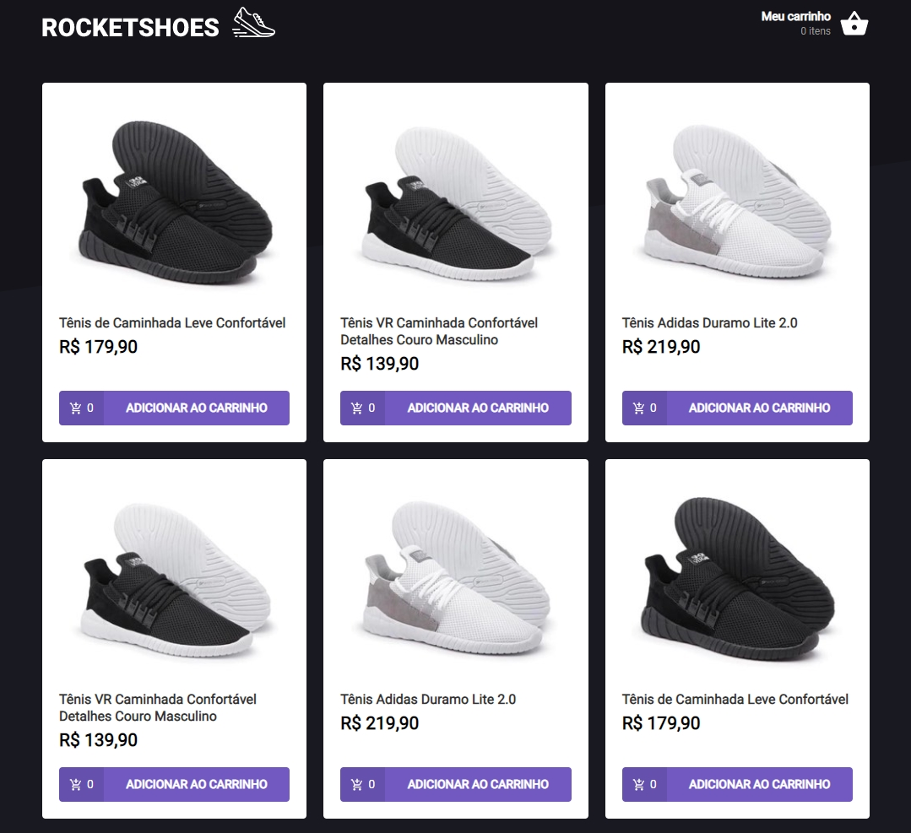
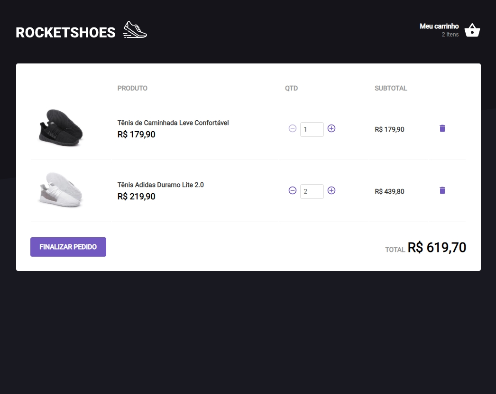

<h1 align="center">
    
</h1>

<h1 align="center">
    
</h1>

## About: 

In this challenge, a hook was created to manage a shopping cart. 

## Technologies:

This project was developed with the following technologies: 

- [React](https://reactjs.org)
- [Styled-components](https://styled-components.com)
- [TypeScript](https://www.typescriptlang.org/)

## How to run:

Clone the project and access the folder.

```bash
$ git clone https://github.com/kevinportella/ignite-desafio-03
$ cd ignite-desafio-03
```

To start it, follow the steps below: 
```bash
# Install dependencies
$ yarn

# Start the project 
$ yarn dev

# Start server 
$ yarn server
```

## License:

This project is under the MIT license. See the file [LICENSE](LICENSE.md) for more details.

---

By Kevin Portella 👋🏽 [Contact](https://www.linkedin.com/in/kevin-bohry-58a4614b/)
